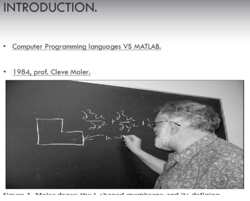

# CHAPTER 1:- Matlab Introduction

## Lec 1. Introduction

**<u>Matlab</u>**:

- Matrix Laboratory 

- Matlab mostly for mathematical calculation...

**why should you learn matlab**?

Matlab purpose was to make programming easier, especially for solving numerical problems, and it's quite popular even now for different purposes, like for data analysis, simulations, mathematical modeling etc...

We can write our code to solve complicated calculations, you can plot equations, you can execute algorithms and many more.

-------------

## Lec 2 - Matlab Layout

Command Window: Main Window

WorkSpace:    Where we can view all Declared variables and Arrays

Current Folder: We can View our current Directory...

Programs on Command Window:

a=1+1    //    Gives a=2

clc => To clear the command window...

clear all    =>    if you want to clear your workspace,

++++

layout option helps to do extra thing like close any window that you are not working on.

+++++++++

layout    ->    Command History    ->    Docked

helps to move or change the size of the command window...

------------
