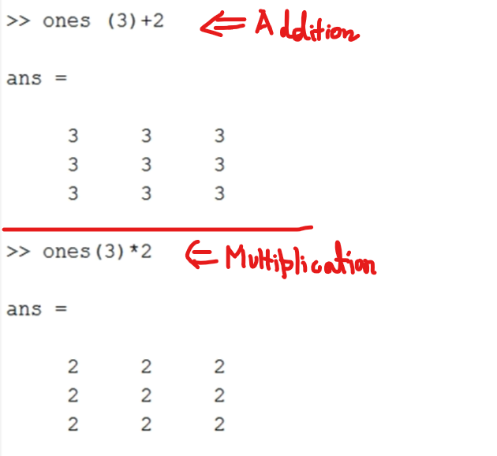

## Lec 3 - Syntax and Basic Functions of Matlab

In Matlab, every variable is stored in a form of a matrix.

length (a)    //    Ans:    3 (Because no. of rows in "a" is 3)

a(2,3)    //    Ans:    6    (i.e. 2nd row and 3rd column)

Use of Transpose Command:    ( )'

Transpose of a Matrix:

Get the number/values without Repeatation: using "unique" function

Finding the total number of unique(c):

length(unique(c))        //        =>    ans:    5 

---------------

## Lec 4 - Basic Arithmatic Operations( +, -, * ,/, .* and ./)

- Use of semicolumn (;) after any function so that we get no result as output...

- Semicolumn(;) is called terminator...

we will use Terminator only when we are declaring variables and don't want to see the results right away.

Multiplication of Matrices:

-----------------------------------+----------------------------

CASE - 1:

For the result for matrix by Matrix Division.

CASE - 2:

if you want to do element to <u>element multiplication</u> (or) element to element division.

Remember: 

- Forward Slash ( \ ) or Backward Slash (/) is Diifferent in Matlab... 

- CASE - 3:
  
  If We use a backward slash (/), this means B is under A as a
  denominator... i.e. <mark>a./b</mark>

- CASE - 4:
  
  If we use forward slash ( \ ), i.e. <mark>a.\b</mark> => this means A is under B as a denominator.

**<u>Dot and Cross Function</u>**:

Dot product  (Scalar Multiplication) of "x" and "y":

Cross product (Cross Multiplication) of "x" and "y":

----------

## How To Generate Matrix and Apply Different Functions On It

 

**<u>ZERO function</u>**:

We can create a matrix filled with zeros.

-

**<u>ONES function</u>**:

We can create a matrix filled with Ones..

-

-

Way to create marix with the same number (other than 0 or 1): e.g: 2, 3 etc... Using Addition and Multiplication sign....

 -

**<u>Matrix using "rand" function</u>**:

rand basically is a function in Matlab in which we can create a matrix using a range of random numbers.

"round" function is used to make the values to "INTEGERS" from "Decimal" format... (As Above shown in the Example...)

**<u>NOTE</u>**:

In every run of the "rand" function will give a different value...

-

I want to know the smallest value in this matrix:

First, I need to declare the matrix and a variable

-

--

**<u>sum function</u>**: To get sum of each Column...

----------------

