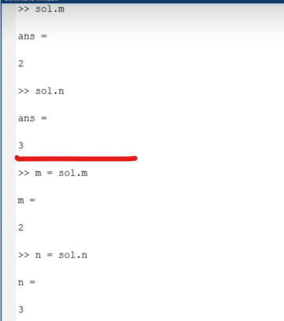

## Lec 6 - How To Solve Different Equations On Matlab (i.e Linear, Quadratic etc.)

"%" Use to make comment in the Matlab...

**<u>Linear Equation</u>**:

-

-

-

---------------

## Lec  7 - Equation Solving Using Linsolv And Solve Function

"sysms" used to make the "x" and "y" symbols...

**<u>Note</u>**:

Matlab won't allow to use "equal to" sign twice in the same line... So use "==".

[a,b]    =>    a,b are new variables for matrics...

Use of "linsolve(a,b)":

Solution=>    x=2 and y=3...

-

-

Steps to use "linsolve" function:

1. First declare symbols using "syms"

2. Make variable of those equations 

3. To convert those equations into matrix

4. Use "linsolve" in the matrix...

-

Steps to use "solve" function:

1. First declare symbols using "syms"

2. Make variable of those equations

3. To solve function for both the symbols of the equations and store the result in new Variable...

----------

## Lec 8 - Equation Solving Using inv Function

Steps:

1. We need to declare symbols...

2. Plot equations in the variable

-

contd...

-

Use of "inv" function:

<mark>ERROR</mark> because "b" only have 1 row... and "a" have 3 rows...

So we use Transpose of "b" to solve this issue... So, there are 3 rows in the "b"... (i.e. convert Row into column)

So use of "inv" function is:

--------------
