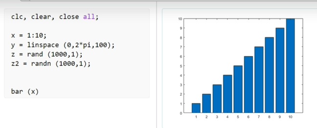
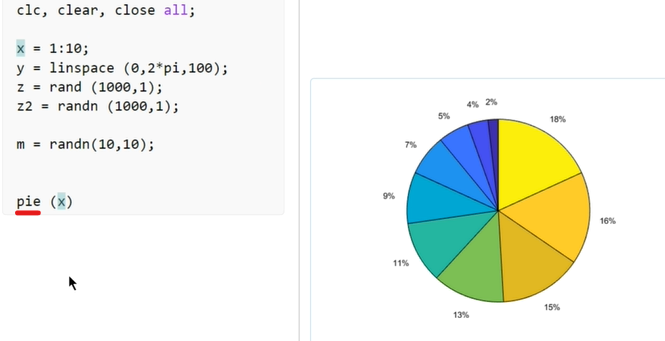

## Lec 9 - Introduction To Matlab Editor

type "edit" keyword in the command window to open EDITOR...

<u>Use of Editor instead of command window</u>:

We can write a bunch of codes or small programs in the form of a script. And also we can Edit the codes anytime easily... While in Command window we can't edit our code anytime... 

After completing the program we just need to press f5 key or the "Run" in the tool panel...

------

## Lec 10 - Plotting The Basic 2-D Graph And How To Change Color And Line Formation Of It

Make an Array of 10 Elements:

a = 1:10;

Contd...

Example:

"a" to starts from Zero and end by 100 with a difference of 10 places...

"linspace" divides all elements equally...

-

Use of "plot" function: 

-

-

Graph of (x,y) and (x,z) is:

Blue line shows (x,y) and orange shows (x,z)

-

To change to colour of the Graph:

Other color changing keywords are:

- plot(x,'r')   =>    For Red

- plot(x,'g')   =>    For Green

- plot(x,'b')   =>    For Blue

- plot(x,'k')   =>    For Black

- plot(x,'w')   =>   For White

- plot(x,'m')   =>  For Mazenda (Pink)

- plot(x,'c')   =>    For Cion (Light Blue)

-

NOTE: "r--" changes the style of line...

-

"*" sign used as 

Here, "*" works as the Marker and ":" is work as line style...

-

x = linspace (0,100,200); 

Q. How hundred number will be placed in two hundred elements?

"linspace" can be used in decimal values.

Steps to Execute:

Step 1. Go to Live Editor bar

Step 2. Click on Run (or) press f5 key...

------------

## Lec 11 - How To Modify The Graph And Plotting Multiple Graphs Using Subplot Command

NOTE:

We can change the name, color of the pop-up window

    For changing the name of the Pop-up window:
    >> figure
    >> figure ('name','graph')
    
    -------------------
    
    For changing the color of the  pop-up window:
    
    >> figure ('name','graph','color','r')
    
    r refers to red...

**<u>Keywords</u>**:

clc    =>    For cleaning the screen...

clear    =>    to delete the previous Arrays...

close all => To clear the programming close before...  

edit    =>    To open the Editor...

title    =>    To add Title in the Graph...

xlabel    =>    To add the label in the x-axis

ylabel    =>    To add the Label in the y-axis

**<u>Keywords</u>**:

legend('sin')    =>    It will display sin and What kind of line "sin" is using

legend keyword is necessary when we make more lines in the Graph... So we can read graph more clearly...

--

keyword:

grid on    =>    To "on" the Grid Lines...

NOTE:
If we  start with "%" sign then line will work as a Comment...

--

<u>How to make lines in the Comment</u>:

Select the lines and press "Ctrl + r" to make the selected lines in Comment... 

-

<u>To Make the commented line again commentless</u>:

Select the lines and press "Ctrl + t"

-

<u>To Split/separate the script into two parts</u>: 

Use "%%"

--

<u>Sub-plotting</u>:

To add more than One graph... Separately on a single chart...

Note: To use the sub-plot function we need to provide the information like Row, Column and the position where to plot the Graph... 

-

-

Implimentations in New:

- change the colour of the lines

- Add Markers

- Line Style

-----------

## Lec 12 - How To Plot Using Different Functions Apart From Plot Function

There are other functions too for the Ploting other than Plot function...

-

-

-

-

-

-

-

-

--

**<u>Difference between rand() and randn()</u>**:

**rand()**:

and 

**randn()**: It gives the value from -1 to +1...

-

-

Making new Array named "m":

1. plot(m)

2. bar (m)

3. hist (m)

4. pie (x)

--

Example:

--

5. scatter:

Note:

Scatter can't be used on a single Array...

6. surf ( ): To make the "m" in 3 - Dimension

(All 3D view...)

--

bar (x)

-

Similarly  we can use for 3D view:  

stem3 (x)

-

pie3 (x)

-

Note:

Function used for Animate a Little:    

comet (x):

-

area (x):

-

barh (x)    =>    bar horizontal

-

bar3h (x)

-------------

## Lec 13 - Graph Plotting With Little Complex Arrays

-

-

-

-

-

-

"filled" command use to fill the vacant parts:

-

Here, we have choosen 4 rows:

-

Array for pi functions:

-

Here, Slices will go backward by 1 point....

-

For slices will no go we need to put 0 instead of 1... 

Example 1:

Example: 2

-

Scatter Function:

Above is the result of three different Arrays... 

Now use of Filled Command in the above example:

-

Example:

-------------------------------
