## Lec 14 - Generation Of Continuous / Discreate signals

**<u>Signals and its Types</u>**:

A signal is a physical quantity that carry information and it can be Vocals, voltage or a Current waveform, pictures etc... 

Mathematically, A signal can be represented as the function of Time (t)... 

--

**<u>Types of signals</u>**:-

- contineous and discrete time signals.

- analog and digital signals

- real and complex signals

- deterministic and random signals

- even and odd signals

- periodic and a-periodic signals

- energy and power signals
  --

<u>Three Important signals</u>:

A) Continous and discrete time signals
B) Even and odd signals

C) Periodic and a-periodic signals

--

**<u>Continous and discrete time signals</u>**:

A signal is Continuous if independent variable "t" is continuous at every interval of time...

**<u>Amplitude (A) - Time (t) Graph</u>**:

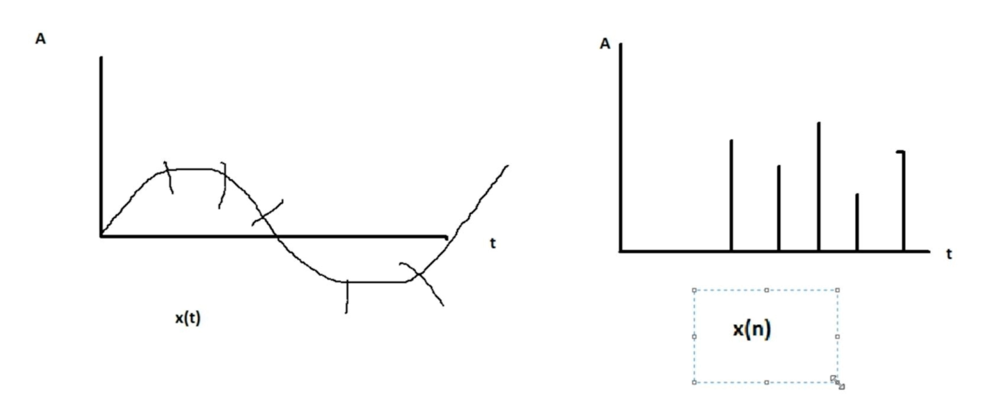

<u>Note</u>:

Continuous time signals is denoted by x(t) and Discrete time signals is denoted by x(n)...

--

**<u>Unit step function</u>**:

<u>Examples of basic Continuous</u>:

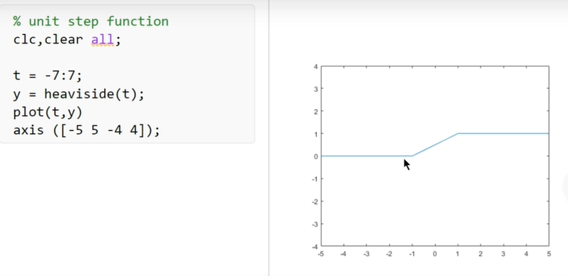

-

We have taken the resolution of 0.001

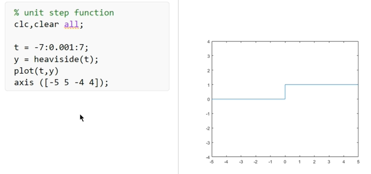

<u>Example of Discrete time signals in matlab</u>:

Here, stem function is used...

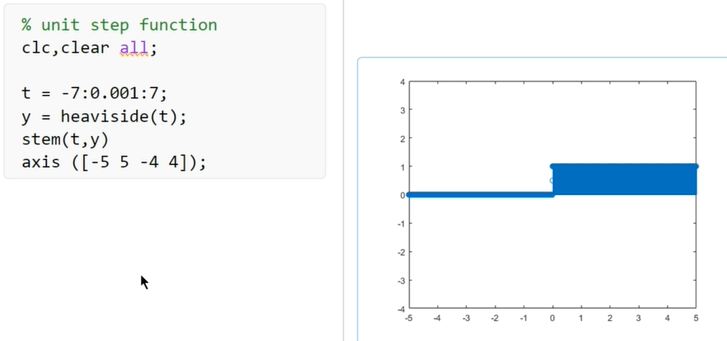

--

**<u>Unit impulse function</u>**:

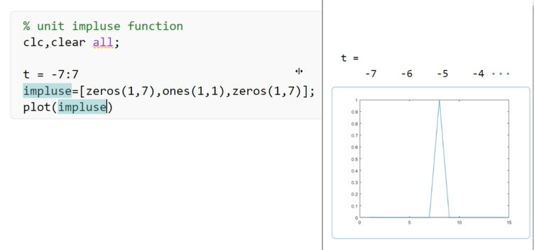

<u>Note</u>:

Matlab bydefault interpulates all the sample values for the better display...

So, use "stem" command instead of "Plot"...

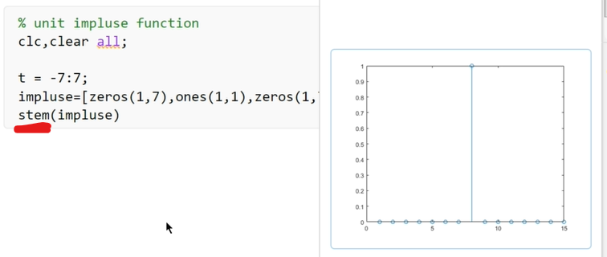

Conclusion:

We are getting appropriate impulse function at t = 0...

--

**<u>Ramp Function</u>**:

Ramp function increases linearly from the point in time where it is not zero it increases with the slop of your choice it can either be one or any other number.

u(t)    =>    u is Unit step sequence/Function and t is time duration

<u>NOTE</u>:

Ramp signal is only valid for positive values of time... that's why we have multiplied t with u(t)...

Since, we have performed individual multiplication... So, use <mark>r = t.*u;</mark> 

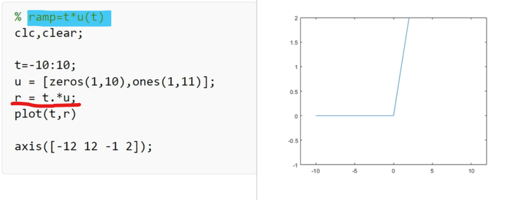

Signals which are made are Ramp Signal...

--

**<u>sinc function</u>**:

It is also known as sampling function. This function arises frequently in signal processing and theory of fourier transforms. It's full name is sine cardinal but it is usually refered as sinc function.

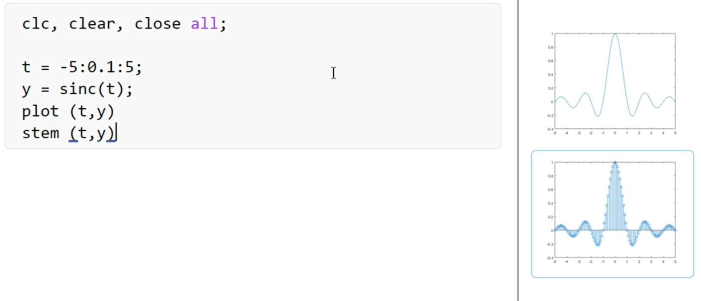

--

**<u>signum function</u>**:
In mathematics, the sign function or signum function (from signum, Latin for "sign") is an odd mathematical function that extracts the sign of a real number.

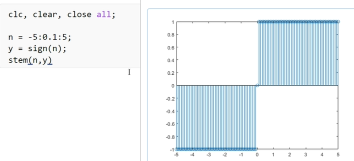

---------------------------------------------------------

## Lec 15 - Periodic / Aperiodic and Even / Odd signals

**<u>Periodic / Aperiodic signals</u>**:

- A signal is periodic signal if it completes a pattern within a measurable time frame, this time frame is called a period and repeats that pattern over identical subsequent periods.

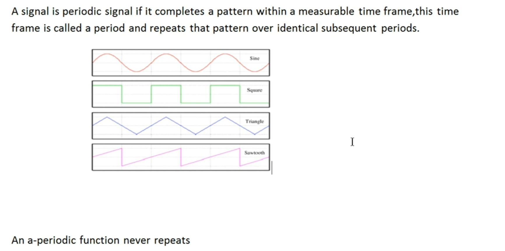

- An a-periodic function never repeats

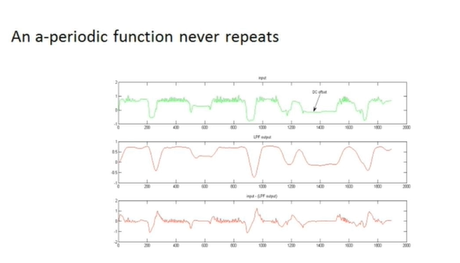

--

**Example of Periodic Signals**:

x = sawtooth(2 pi w t)

<u>Note</u>:

Angular frequency = 2 pi w t

<mark>t = 0:1/1000:0.1</mark> means t = 0 to 0.1 with the spacing of 1/1000

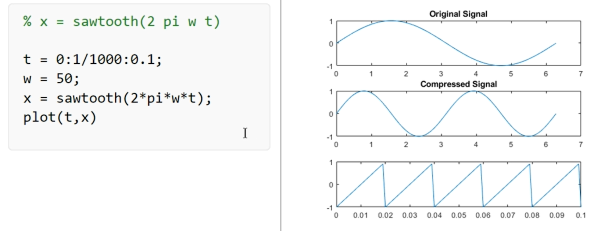

**Example of a-periodic Signals**:

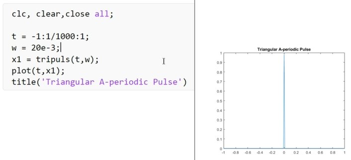

tripuls(_, _)   :    Tripuls are the built in function for the triangular puls...

--

**<u>Even / Odd signals</u>**:

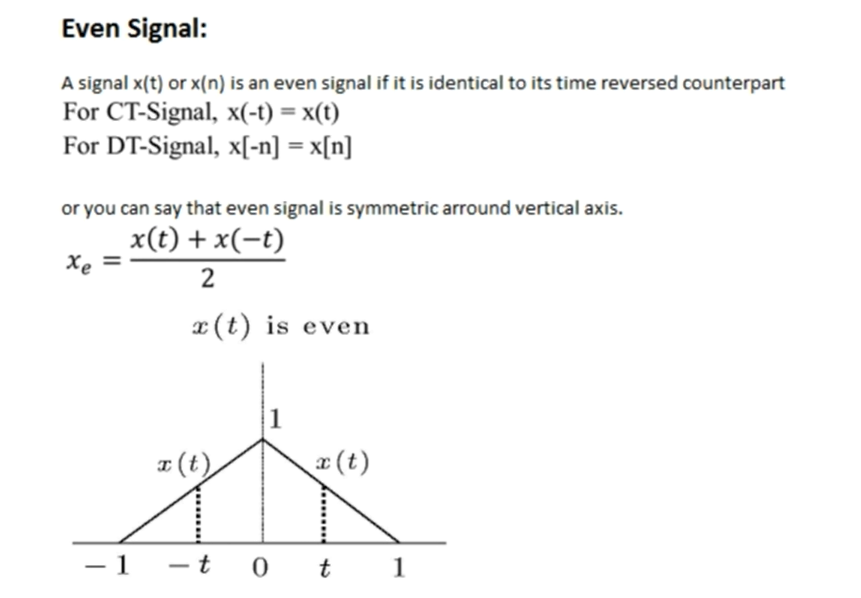

-

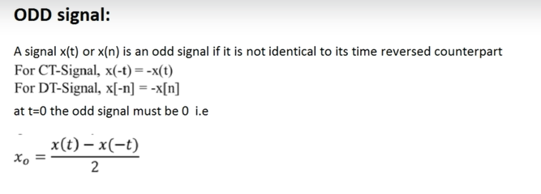

-

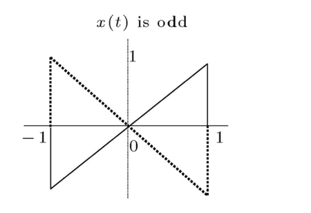

<u>Example</u>:

Variables for Even and Odd signals

For ploting Multiple graphs on same page use the function subplot( )

    clc,clear,close all;
    t = -5:0.001:5;
    x1 = 0.02*exp(t);
    x2 = 0.02*exp(-t);
    xe = (x1+x2)/2;            //Variables for Even signals
    xo = (x1-(x2))/2;        //Variables for Odd signals
    
    subplot (2,2,1);
    plot(t,x1);
    xlabel('t');
    ylabel('x(t)');
    title('signal x(t)');
    
    subplot(2,2,2);
    plot(t,x2);
    xlabel('t');
    ylabel('x(t)');
    title('signal x(-t)');
    
    subplot(2,2,3);
    plot(t,xe);
    xlabel('t');
    ylabel('x(t)');
    title('even part signal x(t)');
    
    subplot(2,2,4);
    plot(t,xo);
    xlabel('t');
    ylabel('x(t)');
    title('odd part signal x(t)');

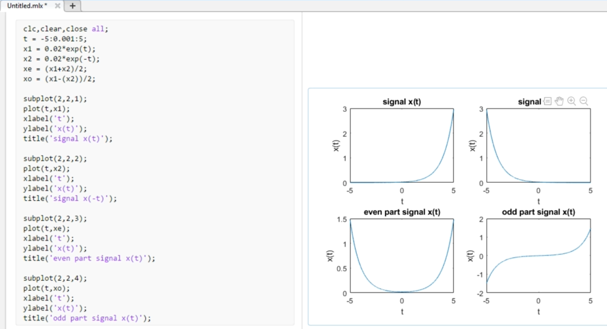

-

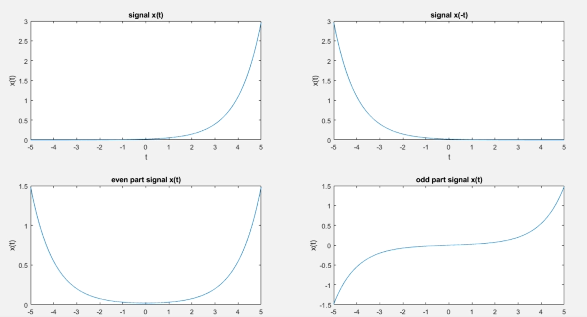

-----------------

## Lec 16 - Implementing Elementary Operations on Signal

**<u>Time shifting operation</u>**:

As the name suggest in this operation we shift the signal in time and this is done by adding and subtracting the amount of shift to the time variable, Subtracting a fixed amount from the time variable will shift the signal to the right (delay) that amount, while adding to the time variable will shift the signal to the left (advance).

-

    clc,clear;
    syms t
    x = sinc(t);
    
    sunbplot(311)
    F = ezplot(x,[-5,5]);
    set(F,'LineWidth',2)
    title('Original signal')
    grid
    
    subplot(312)
    y1 = subs(x,t,t-2);
    F = ezplot(y1,[-5,5]);
    set(F,'LineWidth',2)
    title('Delayed signal')
    grid
    
    subplot(313)
    z1 = subs(x,t,t+2);
    F = ezplot(z1,[-5,5]);
    set(F,'LineWidth',2)
    title('Advanced Signal')
    grid

-

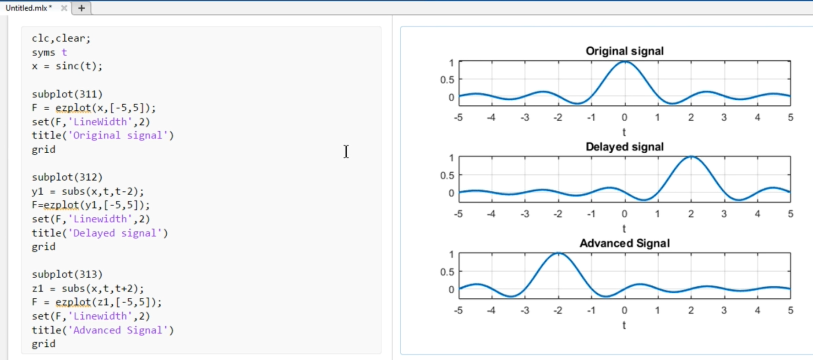

'syms' command creates a symbolic variable in Matlab in Matlab Workspace...

subplot(311)    =>    3 for Rows, 1 is for column and last 1 is for the First Graph...

ezplot() function can plot the function over the Default Domain...

 --

**<u>Time reversing</u>**:

In this operation reversal of the time axis, or flipping the signal over the y-axis will be observed. It is also called time folding. The signal x(-t) is obtained from the signal x(t) by flipping it without moving the signal from its origin.

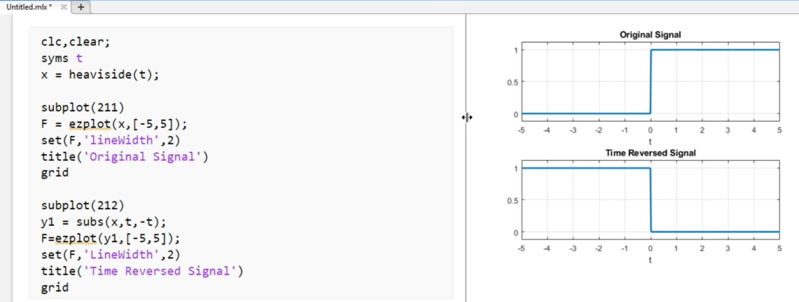

Note: The Second plot is the Mirror image of First one...

--

**<u>Time Scaling</u>**:

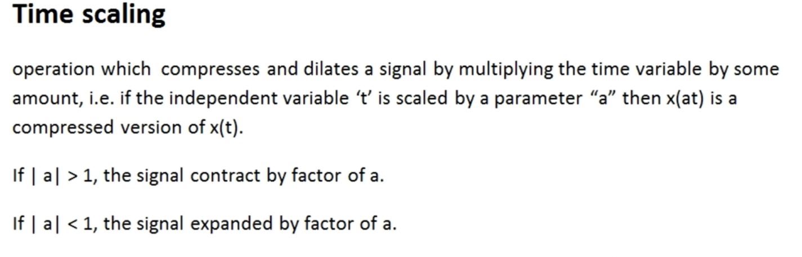

Example:

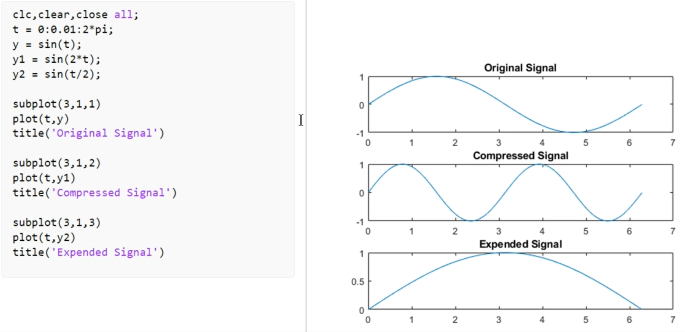

-----------------------

## Lec 17 - Convolution and Correlation:

**<u>Convolution</u>**:

If you have an LTI system and you know the impulse response of it then by using convolution you can find the output of that Iti system for the given input.

-

**Impulse response?**
It is the output of the signal at a breif or short input signal (which is impulse)

--

Example:

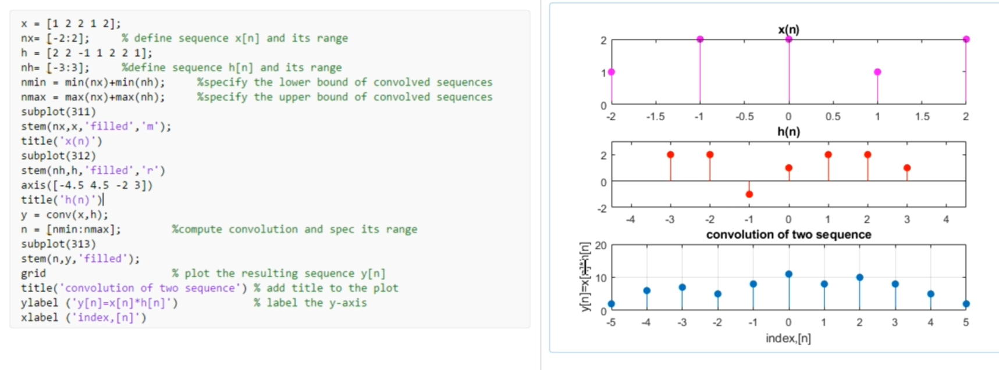

We are plotting 3 Graphs for Input Signal, Impulse Response and the Convolve Signal...

subplot(311)    =>    3 Rows and 1 Column

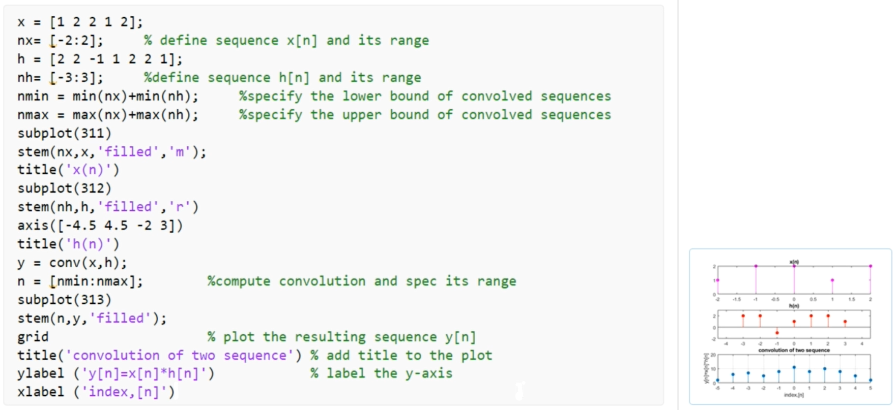

-

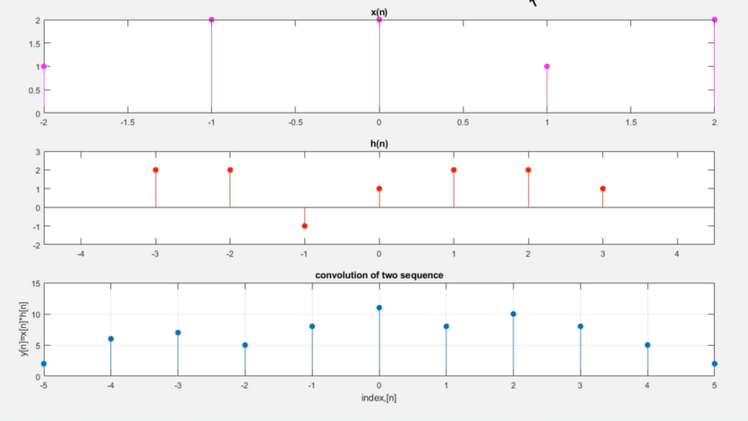

--

**<u>Correlation</u>**:

Correlation is a mathematical function and it is the measure of the similarity between two signals as a function to time shift between them. Correlation is maximum when two signals are similar in shape and are in phase. 

We divide correlation into two types:

a) Auto correlation

b) Cross correlation.

--

In **cross correlation** we measure the degree of similarities of two different signals or we can say that in cross corelation we compare two different signals and measure the degree of similarities between them...

a) **Auto correlation**
We compare a signal with its shifted version...

--

**<u>Example</u>**:

For Cross Correlation

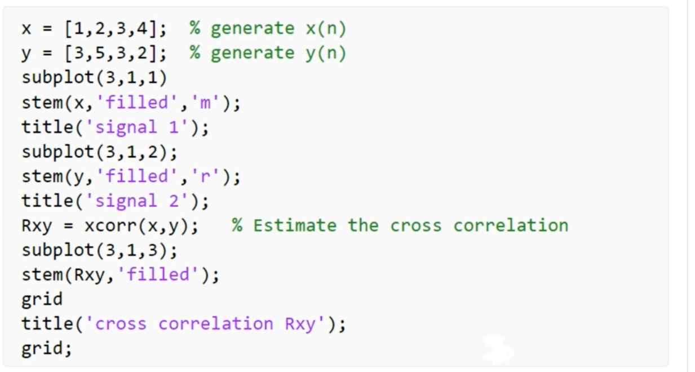

-

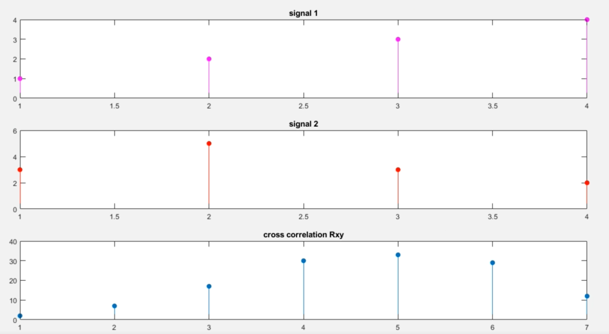

xcorr( ) is an Bulit-in function...

--

**<u>Example</u>**:

For Auto - Correlation

(We compare a signal with its shifted version...)

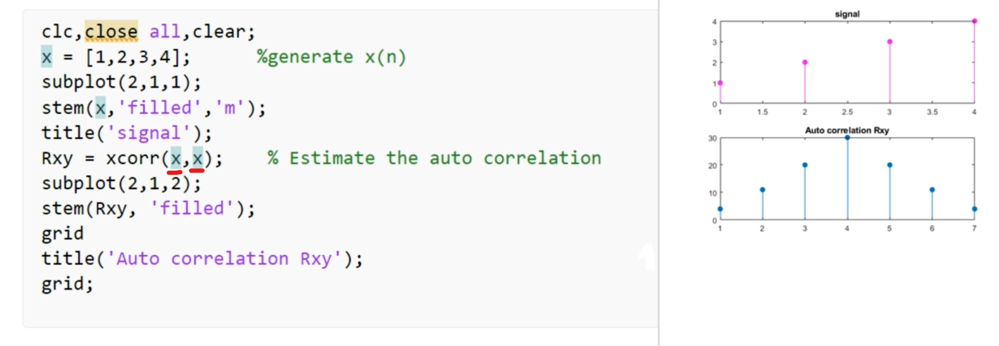

-----------------
