## Lec 18 - What is Loop and For-Loop

<u>LOOPs</u>:
loops permit us to execute a sequence of statements more than once.

<u>THE FOR LOOP</u>:

for loop allows you to execute a block of code many times & each time the block is executive, index variable changes value for some time & when the code is repeated the number of repetition is known before the loop actully start.

```
Syntax:

for    index = (vector or expression)
       codes of statements
end
---------------------------------------------------------
for like a,b,x,y = starting point (1) and ending point (5)
    instructions
end
```

---------------------

## Lec 19 - How to use For-Loop part1

**Case - 1**:

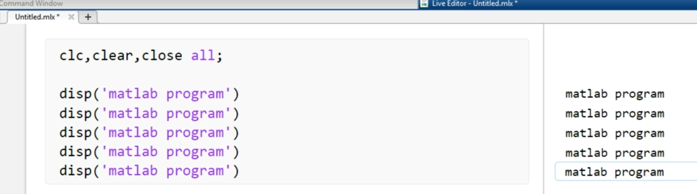

--

**Case - 2**:

for a = 1:50    =>    1:50 is a draw vector...

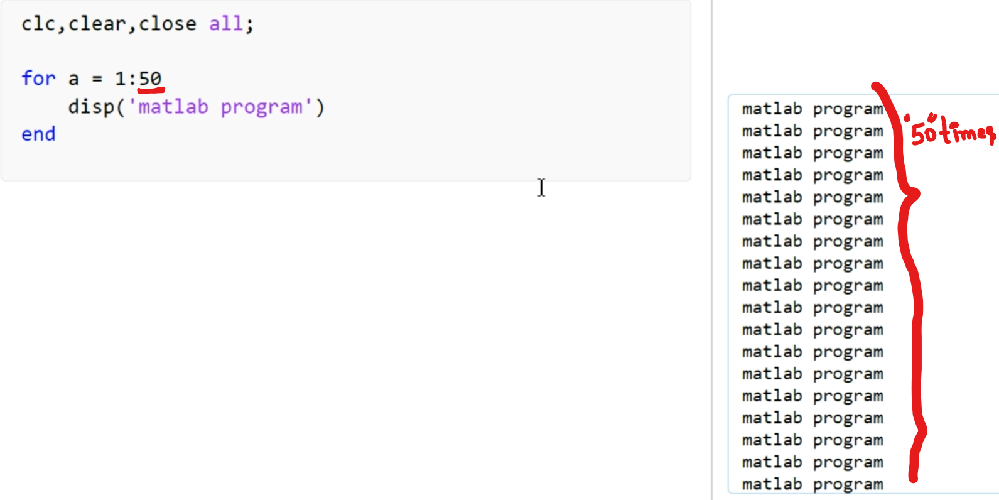

--

Adding index in the statement:

loop will be work from 1 to 5...

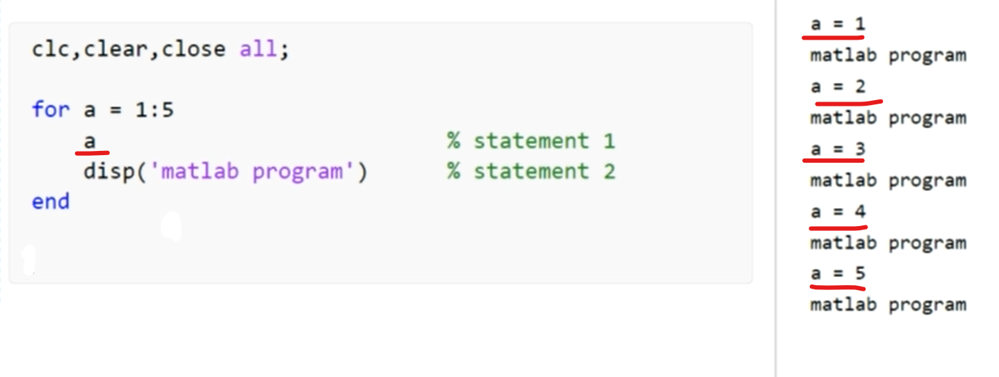

-------------

## Lec 20 - How to use For-Loop part 2

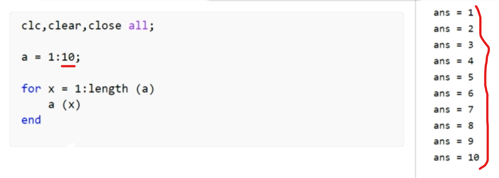

--

Example:

We mentioned 10 elements (i.e. <mark>a = 1:10;</mark>) but it further not go because "for" loop will work upto <mark>5</mark> (i.e. for x = 1:<mark>5</mark>)

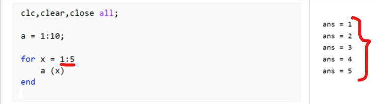

Here in output :- 1, 2, 3, 4 and 5 are not numbers... 1 is the 1st point and 5 is the 5th point...

--

Example:

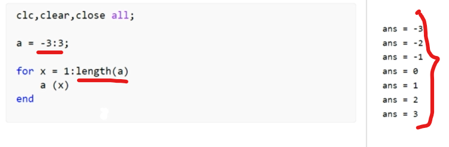

--

Example:

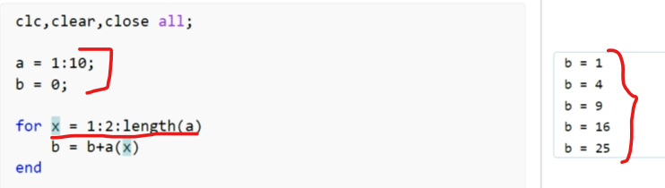

In Command window:

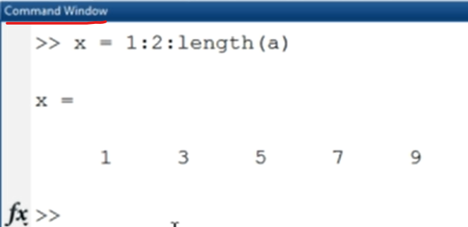

-

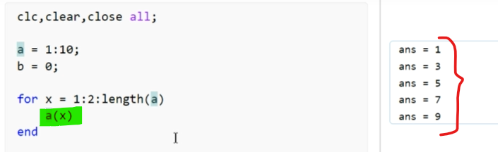

--

Example:

5:14    =>    10 times    

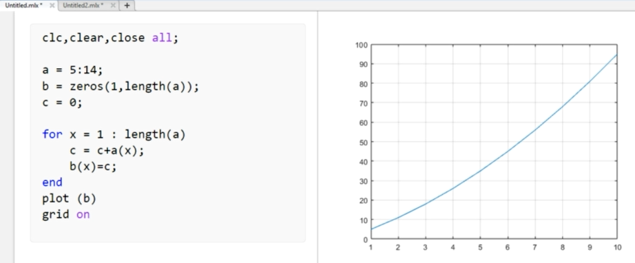

In command window:

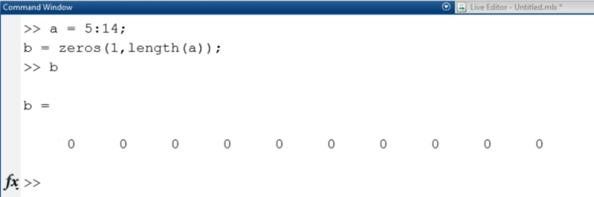

-

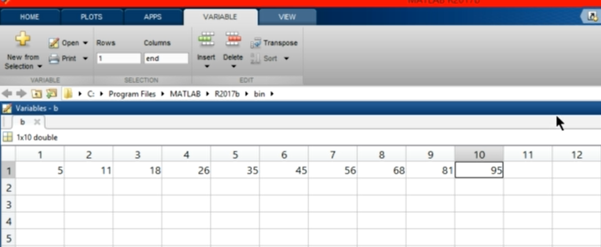

-----------------------

## Lec 21 - Write a program to calculate Factorial of a number

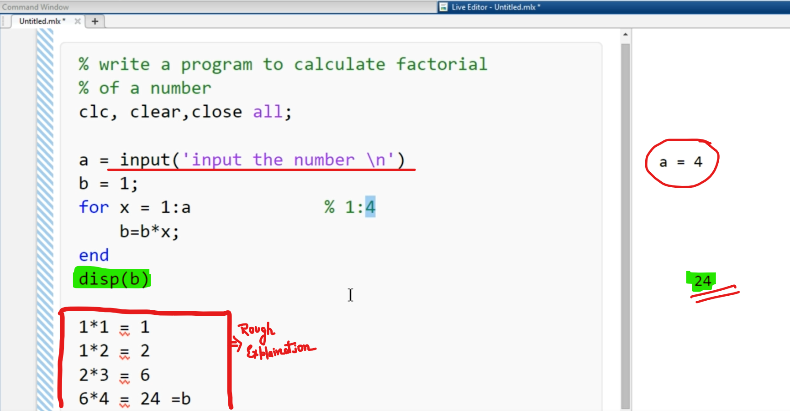

-

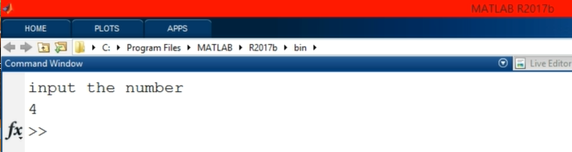

Use of printf:

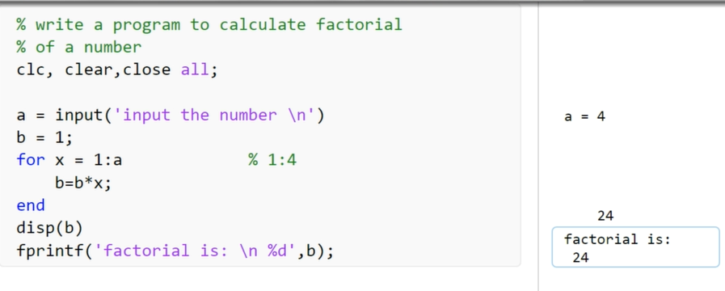

-

Running the matlab program:

    >> run factorial.mlx

Program run:

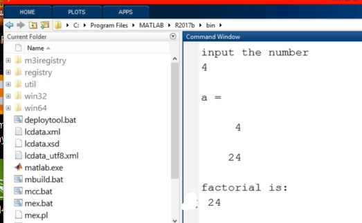

---------------------

## Lec 22 - Write a program to calculate your Profit Amount

<u>Money in the bank grossing with given time</u>:

<mark>c = zeros(1,y);</mark>    =>    We need something to put our value in...

c is the vector which is 1 to y... and "y" is the time in years

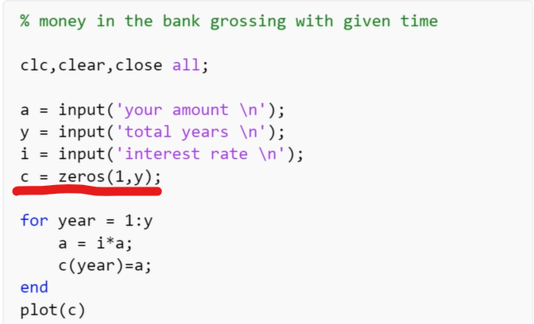

-

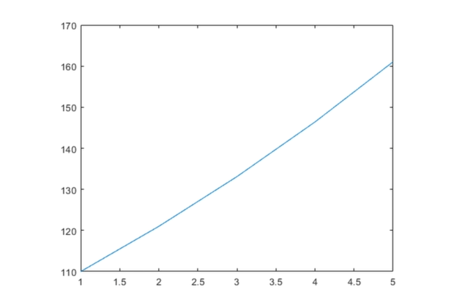

-

    your amount
    100
    total years
    5
    intrest rate
    1.1

-

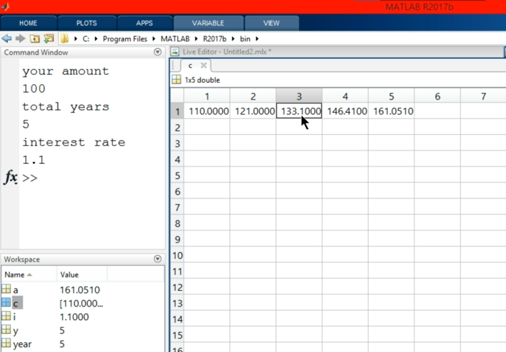

Above shows at which point our amout is "Due"...

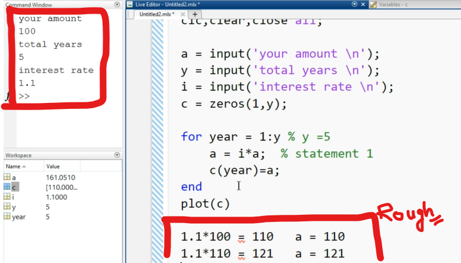

-------------------


