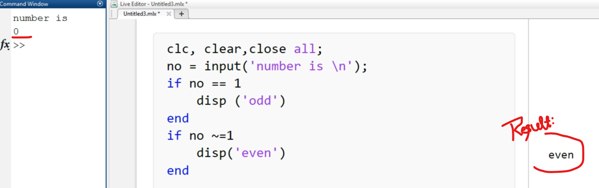
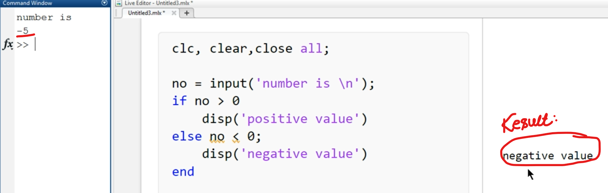
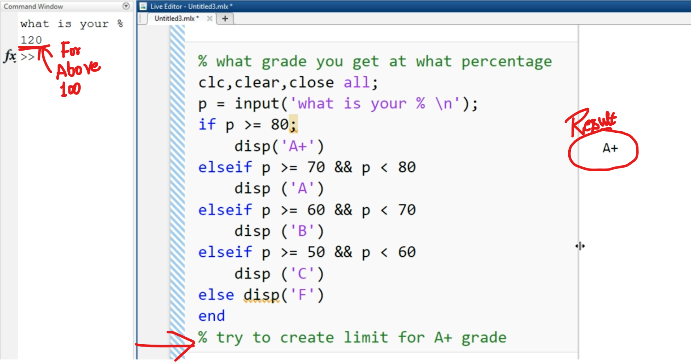

## 23 What is lf-Loop

lF Loop:
if loop used to do a conditional execution between two numbers.
I have two numbers A and B and i wanna find larger number then if loop will use.

    Syntex
    
    if    expression
          codes/ statements
    end

but now i wanna create situation when if loop check and say x is not = to y then in this situation i don't wanna end the program but i wanna do something else to make this type situation we have function called else and it is part or if loop like

    if    expression
          code/ statements
    else
          code/ statement
    end

and if have more than 2 senorio then we can use another function called elseif and it is also part of if loop and must be before else function and we use elseif function more than once and the syntex will be something like this

    if        expression
              code/ statements
    elseif    expression
              code/ statement
    else
              code/ statement
    end

-

    we will also use relational operators like these
    <    less than
    
    <=    less than or equal to
    
    >    greater than
    
    >=    greator than or equal to
    
    ==    equalto
    
    ~=    not equal to

--------------

## Lec 24 - How to use lf-Loop

-

-

-

----------------

## Lec 25 - Write a program to calculate your grades

-

-------------------------

