## Lec 26 - Types of Functions & Create Simple Functions

**<u>Types of function</u>**:

1. User defined functions

2. Functions function

3. Special function
   
   - Sub-function
   
   - Private function
   
   - Nested function

--

Syntax:

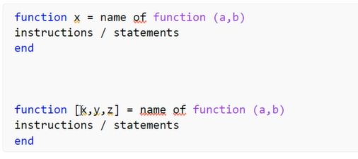

--

Example:

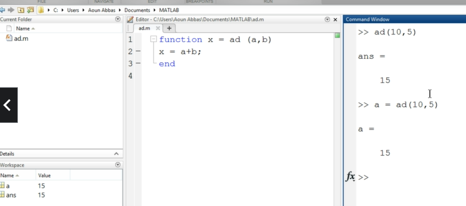

ad    =>    Addition

-

    // Subtraction
    function x = sb (a,b)
    x = a-b;
    end

Example:

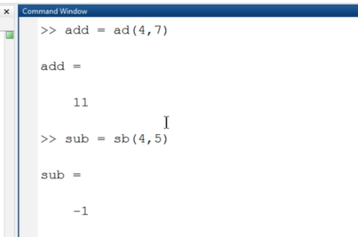

-

    // Multiplication
    function x = mu (a,b)
    x = a*b;
    end

-

    // Division
    function x = di (a,b)
    x = a/b;
    end

Example:

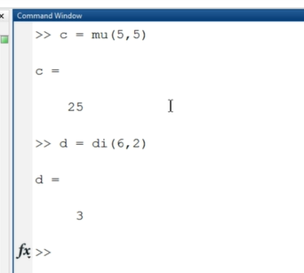

-

Example:

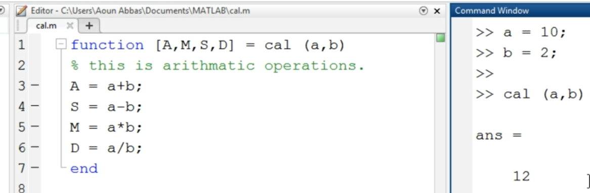

-

Running of calculations:

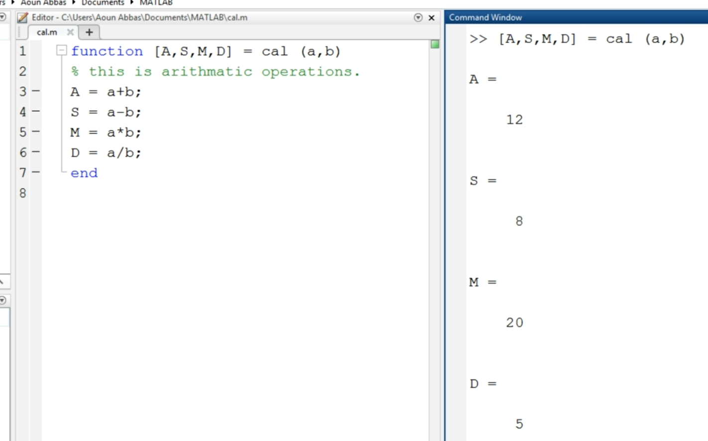

--

Using Command:

    >> help plot
    
    It will show every instructions related to the plot function...

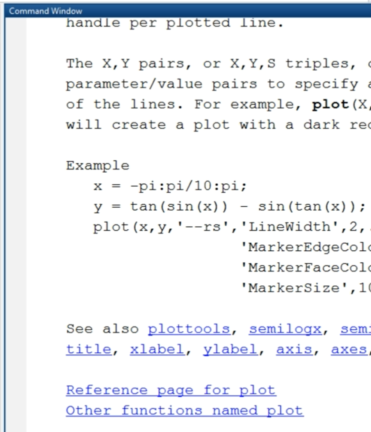

-

Since "cal" function is made by the User

    >> help call
    this is arithmatic operations.

-----------------------------

## Lec 27 - Make a Function to Solve Quadratic Equations

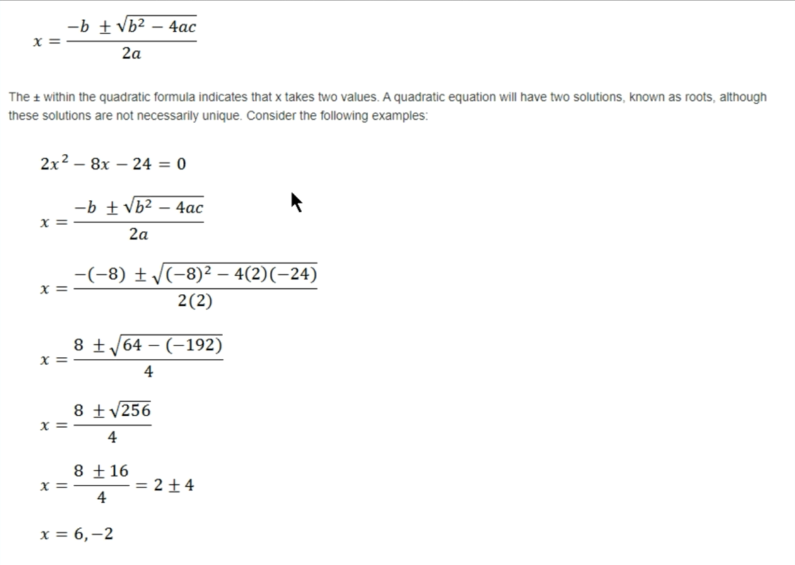

-

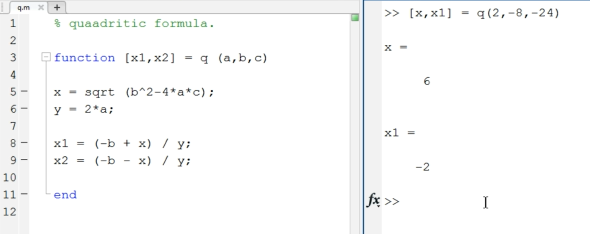

------------------

## Lec 28 - Special Types of Function part 1

- Sub-function

- Private function

- Nested function

**<u>Sub-function</u>**: 

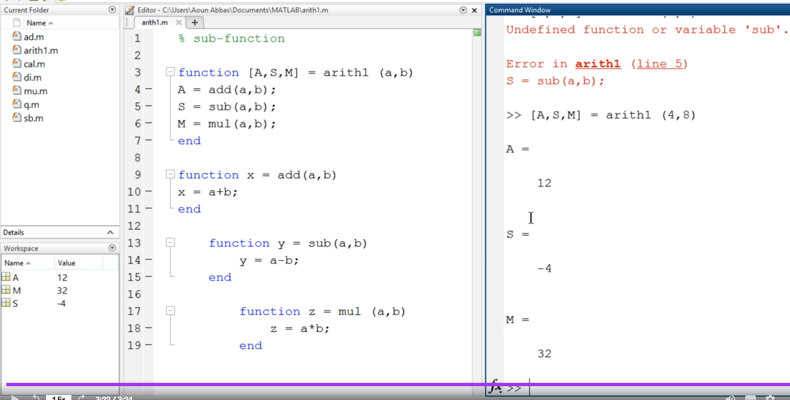

-------------

## Lec 29 - Special Types of Function part 2

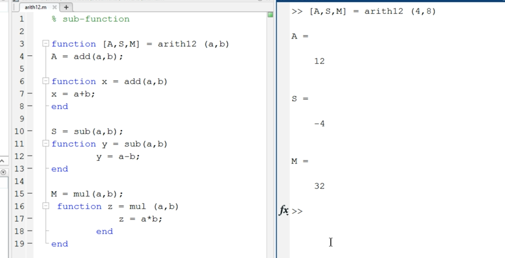

-

 Private Function:

It is used when we create our own function...

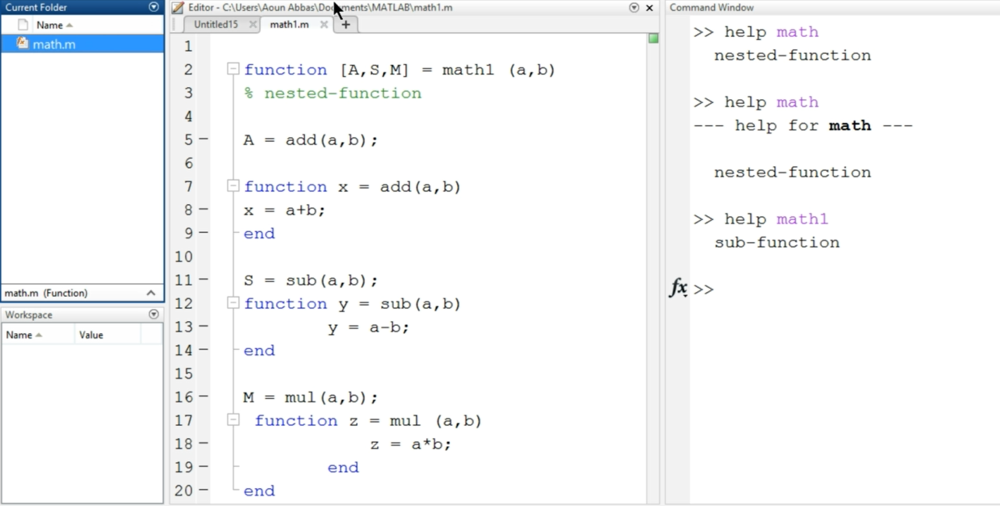

--------------------
